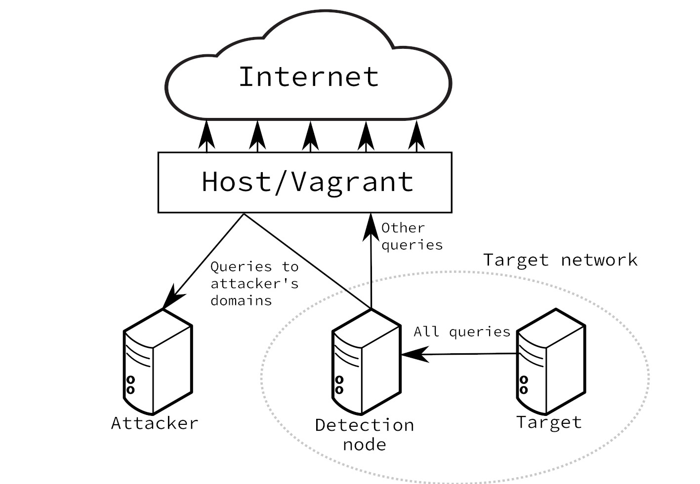

# DNS exfiltration simulator
This repo is a part of my bachelor's thesis focused on data exfiltration using the DNS protocol. The thesis is not published yet.

The simulation revolves around `target` generating data and sending them to the `attacker` using one of the implemented, parametrized exfiltration vectors.

This repo also contains an environment to test the simulation, including a `Detection node` with a `Suricata` instance as well as the detection script in the `ids` folder. Once deployed, it looks like this.

Each folder contains an additional `README.md`.

Feel free to use the `target` and `attacker` scripts on their own or using the provided environment.

## To use the environment
1. You need `Vagrant` + `VirtualBox` + `Ansible`.
2. `Vagrantfile` contains several configurable options (with default values) needed to set up the environment and the scripts.
3. Run `vagrant up` and wait.
4. SSH into all three machines. (`vagrant ssh attacker`, `vagrant ssh target`, `vagrant ssh dnsserver`)
5. If you want to use the detection script:
   1. `cd ids`
   2. `python3 sniffer.py`
6. On `attacker`, run `sudo python3 attacker <profile name>`. (See `attacker/readme.MD`)
7. On `target`, run `python3 target <profile> <profile number>`. (See `target/readme.MD`)

## Implemented vectors
- [FrameworkPOS](https://www.gdatasoftware.com/blog/2014/10/23942-new-frameworkpos-variant-exfiltrates-data-via-dns-requests)
- [MultigrainPOS](https://www.fireeye.com/blog/threat-research/2016/04/multigrain_pointo.html)
- [Ebury](https://www.welivesecurity.com/wp-content/uploads/2014/03/operation_windigo.pdf)
- [Kessel](https://www.welivesecurity.com/wp-content/uploads/2018/12/ESET-The_Dark_Side_of_the_ForSSHe.pdf)
- FasterVec - invented by me, described in the thesis
- SlowerVec - invented by me, described in the thesis
